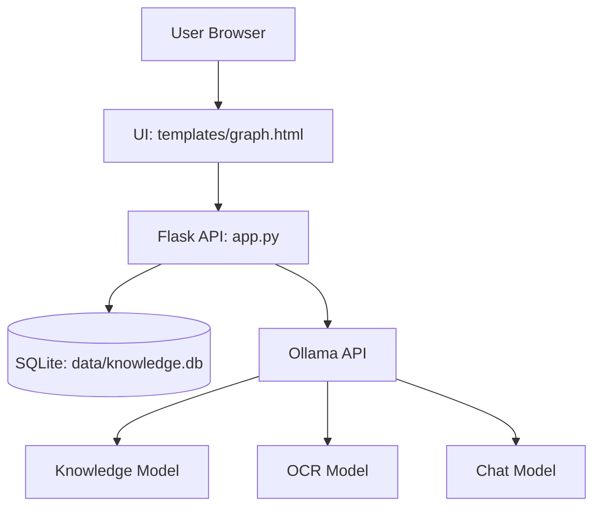
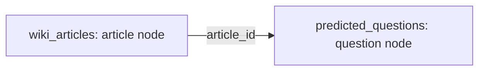

<h1 align="center">LLM-WIKI</h1>

<p align="center"><strong>Customer Question Prediction Knowledge Graph powered by Flask + SQLite + Ollama + D3.js</strong></p>

<p align="center">
  
  
  
  
  
  
</p>

<p align="center">
  <a href="http://127.0.0.1:5000"><strong>Local</strong></a>
  ·
  Deploy with <strong>render.yaml</strong> (see Deploy below).
</p>

---

## Overview

LLM-WIKI is a practical knowledge-operating demo for reverse question generation.  
It ingests knowledge files, extracts knowledge points, predicts customer-facing questions, and visualizes relationships in an interactive force-directed graph.  
The built-in assistant (`Gokou's Bot`) answers based on the current knowledge base through local LLM inference.

## Graph

### System Architecture



### Knowledge Graph Model



- **Article Node**: `id=article-{id}` with `title/content/source`
- **Question Node**: `id=question-{id}` with `question/question_type`
- **Edge Rule**: one article maps to many predicted questions via `article_id`

## Features

- Multi-format ingestion: `PDF / DOCX / TXT / MD / CSV / TSV / XLSX / images`
- Knowledge-point extraction + customer question prediction
- D3 interactive graph (drag / zoom / focus highlight)
- Knowledge preview, deletion, pagination, and upload workflow
- Local chatbot with model fallback strategy for robustness

## Repository Structure

```text
.
├─ app.py
├─ init_db.py
├─ requirements.txt
├─ render.yaml
├─ .env.example
├─ data/
│  └─ knowledge.db
├─ knowledge_sources/
├─ static/
│  └─ images/
├─ templates/
│  └─ graph.html
└─ README.md
```

## Quick Start

```bash
pip install -r requirements.txt
ollama pull gemma4:latest
ollama pull deepseek-ocr:latest
ollama pull llama3.2:latest
python init_db.py
python app.py
```

Open: <http://127.0.0.1:5000>

## Environment Variables

```env
OLLAMA_API_URL=http://127.0.0.1:11434/api/generate
KNOWLEDGE_MODEL=gemma4:latest
OCR_MODEL=deepseek-ocr:latest
CHAT_MODEL=llama3.2:latest
```

## Deploy (Render)

1. Push this repo to GitHub.
2. In [Render](https://dashboard.render.com): **New** → **Blueprint** → choose the repo and `render.yaml`.
3. Set environment variables in the service (or add them to the blueprint under `envVars`):
   - `OLLAMA_API_URL` — must point to a reachable Ollama instance (e.g. your own server with `/api/generate`). Render’s free web service does not run Ollama on the same dyno.
   - `KNOWLEDGE_MODEL`, `OCR_MODEL`, `CHAT_MODEL` — same as local.

**SQLite on Render:** the default disk is ephemeral; redeploys can reset `data/knowledge.db`. For persistence, use a [Render disk](https://render.com/docs/disks) mounted at your app’s data path, or migrate to Postgres.

## Production Notes

- Keep `.env` private and never commit secrets.
- Production web process uses **Gunicorn** (see `render.yaml`); local dev still uses `python app.py`.
- Optionally set `BIND_HOST=0.0.0.0` and `PORT` when running Flask directly behind a tunnel.
- Ensure Ollama (or compatible API URL) is reachable from the deployed host with the configured models pulled.
