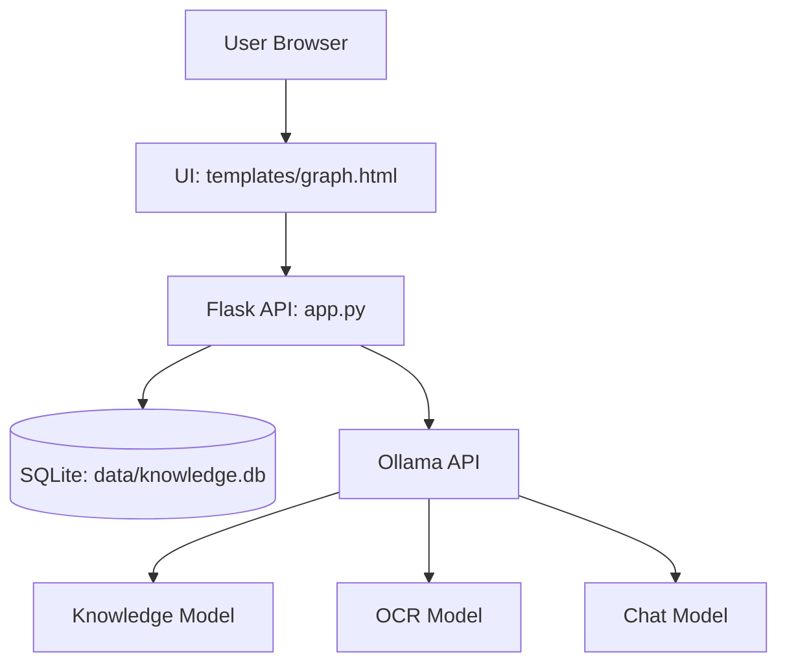
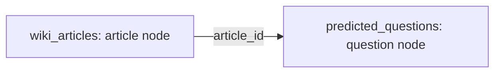

# LLM-WIKI: Customer Question Prediction Knowledge Graph


LLM-WIKI is a Flask-based knowledge graph demo for reverse question generation and policy-oriented knowledge exploration.  
It combines structured extraction, graph visualization, and local LLM chat into one deployable project.

## Demo

- Local: <http://127.0.0.1:5000>
- Repository: <https://github.com/SuperGokou/gokousllmwiki.git>

## Graph Description

### 1) System Architecture Graph



### 2) Knowledge Graph Data Model



- **Article Node**: `id=article-{id}`, stores title/content/source
- **Question Node**: `id=question-{id}`, stores question/question_type
- **Edge Rule**: one article links to many predicted questions by `predicted_questions.article_id`

## Core Capabilities

- Multi-format ingestion: `PDF / DOCX / TXT / MD / CSV / TSV / XLSX / images`
- Knowledge-point extraction and question prediction
- D3 force-directed graph with interaction (drag, zoom, highlight)
- Paginated knowledge list and preview modal
- Local chat assistant (`Gokou's Bot`) backed by Ollama

## Project Layout

```text
.
├─ app.py
├─ init_db.py
├─ requirements.txt
├─ .env.example
├─ data/
│  └─ knowledge.db
├─ knowledge_sources/       # exported uploaded knowledge files (markdown form)
├─ static/
│  └─ images/
├─ templates/
│  └─ graph.html
└─ README.md
```

## Included Uploaded Knowledge Files

Current uploaded knowledge sources are exported under `knowledge_sources/` and committed with the repository for reproducibility.

## Quick Start

```bash
pip install -r requirements.txt
ollama pull gemma4:latest
ollama pull deepseek-ocr:latest
ollama pull llama3.2:latest
python init_db.py
python app.py
```

## Environment

```env
OLLAMA_API_URL=http://127.0.0.1:11434/api/generate
KNOWLEDGE_MODEL=gemma4:latest
OCR_MODEL=deepseek-ocr:latest
CHAT_MODEL=llama3.2:latest
```

## Production Notes

- Keep `.env` private; never commit secrets.
- Replace Flask dev server with Gunicorn/uWSGI + reverse proxy in production.
- Ensure Ollama service and required models are available on target host.
